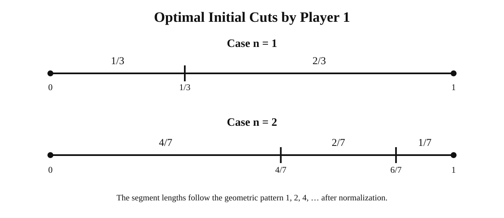

# IMO 2026 Problem 3 — Stick-Cutting Game

A technical companion note for **Problem 3 of the 2026 International Mathematical Olympiad**, focused on the mathematical structure behind the game: pairing, exploitable symmetry, the optimal powers-of-two construction, and the guaranteed value of the first player.

- Official problem page: https://www.imo-official.org/problems/
- Problem: IMO 2026, Problem 3
- Proposed by: Russian Federation

## Problem

Let `n` be a positive integer. Player 1 first marks at most `n` points on a stick of length `1`. Player 2 sees those marks and then marks at most `n` additional points, all distinct from the earlier marks. The stick is cut at every marked point. The players then alternate claiming unclaimed pieces, with Player 1 choosing first. Each player wants to maximize the total length obtained.

For each `n`, determine the largest value `c_n` that Player 1 can guarantee regardless of Player 2's play.

## Main result

The exact value is

$$
\boxed{c_n=\frac{2^n}{2^{n+1}-1}}.
$$

Equivalently, if

$$
\delta=\frac{1}{2^{n+1}-1},
$$

then

$$
c_n=\frac{1+\delta}{2}.
$$

The quantity `δ` is also the smallest advantage in total length that Player 1 can force over Player 2 under optimal play.

## The drafting stage

Suppose the final piece lengths, in non-increasing order, are

$$
x_1\ge x_2\ge \cdots \ge x_m.
$$

Because the players alternately choose any remaining piece, optimal play at the drafting stage gives Player 1 the odd-indexed pieces in the sorted list:

$$
x_1+x_3+x_5+\cdots.
$$

Define the alternating difference

$$
A=x_1-x_2+x_3-x_4+\cdots.
$$

Since the total length is `1`, Player 1's final share is

$$
\frac{1+A}{2}.
$$

So the problem reduces to controlling the smallest possible value of `A` after Player 2 refines Player 1's initial partition.

## Player 2's basic idea: create counterparts

Player 2 benefits from symmetry. If the final pieces can be arranged into equal pairs, then whenever Player 1 chooses one piece, Player 2 can take its identical counterpart.

That produces an exact tie:

$$
\boxed{\frac12:\frac12}.
$$

This observation already explains two simple ways Player 1 can lose the first-mover advantage.

### Failure case 1: Player 1 creates too few pieces

If Player 1 creates at most `n` initial pieces, Player 2 can bisect every one of them. For a piece of length `x`,

$$
x\longrightarrow \frac{x}{2}+\frac{x}{2}.
$$

Every piece now has an identical counterpart, so Player 2 can force a tie.

### Failure case 2: Player 1 creates two equal pieces

Even if Player 1 uses all `n` cuts and creates `n+1` pieces, two equal pieces are already enough to give Player 2 a complete pairing strategy.

Suppose two initial pieces have length

$$
x,\qquad x.
$$

They already form one pair. At most `n-1` other pieces remain. Player 2 can bisect each of those using at most `n-1` cuts, turning every remaining piece into another equal pair.

Again, the entire board can be paired, so Player 2 forces

$$
\boxed{\frac12:\frac12}.
$$

The lesson is that Player 1 must avoid exploitable symmetry from the beginning.

## Player 1's optimal construction

Player 1 chooses `n+1` initial pieces proportional to successive powers of two:

$$
1,2,4,\ldots,2^n.
$$

Let

$$
D=2^{n+1}-1.
$$

The normalized piece lengths are therefore

$$
\frac1D,\quad \frac2D,\quad \frac4D,\quad \ldots,\quad \frac{2^n}{D}.
$$

They sum to one because

$$
1+2+4+\cdots+2^n=2^{n+1}-1=D.
$$

This construction guarantees Player 1 at least

$$
\boxed{\frac{2^n}{2^{n+1}-1}}.
$$

## Worked example: `n = 1`

Player 1 begins with

$$
\frac13,\qquad \frac23.
$$

If Player 2 does not cut, Player 1 simply takes `2/3`.

If Player 2 bisects the larger piece,

$$
\frac23\longrightarrow \frac13+\frac13,
$$

then the three pieces are all `1/3`, and Player 1 still receives two of them. Hence

$$
\boxed{c_1=\frac23}.
$$

This is a useful example of a legal response that changes the board but does not improve Player 2's final outcome.

## Worked example: `n = 2`

Player 1 begins with

$$
\frac47,\qquad \frac27,\qquad \frac17.
$$

A natural response is to bisect the largest piece:

$$
\frac47\longrightarrow \frac27+\frac27.
$$

If Player 2 stops there, the pieces are

$$
\frac27,\quad \frac27,\quad \frac27,\quad \frac17,
$$

and Player 1 can secure `4/7`.

Player 2 still has another cut. For example,

$$
\frac27\longrightarrow \frac17+\frac17.
$$

The configuration changes again, but Player 1 can still secure

$$
\boxed{\frac47}.
$$

The full theorem states that no legal response can push Player 1 below this value.

## Proof that Player 1 can guarantee the lower bound

Set

$$
\delta=\frac{1}{2^{n+1}-1}.
$$

Player 1 uses the initial lengths

$$
\delta,2\delta,4\delta,\ldots,2^n\delta.
$$

After Player 2 makes at most `n` cuts, there are at most `2n+1` final pieces. Sort them in non-increasing order and, if necessary, append zero-length pieces so that there are exactly `2n+1` entries:

$$
x_1\ge x_2\ge\cdots\ge x_{2n+1}\ge0.
$$

Pair consecutive entries

$$
(x_1,x_2),(x_3,x_4),\ldots,(x_{2n-1},x_{2n}),
$$

and pair the final piece `x_{2n+1}` with a dummy zero piece.

Tag each final piece by the original geometric piece from which it came. Build a graph whose vertices are the `n+1` original pieces together with the dummy zero vertex, and whose edges correspond to the `n+1` pairs above.

The graph has `n+2` vertices and `n+1` edges. Therefore at least one connected component is a tree. Two-color that tree with signs `+1` and `-1`, and assign sign `0` to all vertices outside the tree.

The signed sum of the original geometric lengths then has the form

$$
\delta\left(\varepsilon_0+2\varepsilon_1+\cdots+2^n\varepsilon_n\right),
\qquad
\varepsilon_i\in\{-1,0,1\},
$$

with not all coefficients zero. Because a largest nonzero power of two exceeds the sum of all smaller powers, this signed integer cannot vanish. Its absolute value is therefore at least `δ`.

On the other hand, every tree edge joins opposite signs, so its contribution is bounded by the corresponding difference between two consecutive sorted pieces. Hence

$$
A=(x_1-x_2)+(x_3-x_4)+\cdots+x_{2n+1}\ge \delta.
$$

Therefore Player 1 receives at least

$$
\frac{1+A}{2}
\ge
\frac{1+\delta}{2}
=
\frac{2^n}{2^{n+1}-1}.
$$

## Proof that Player 2 can hold Player 1 to the upper bound

Now let Player 1 choose any initial partition.

If there are at most `n` initial pieces, Player 2 bisects every piece and forces a tie, so the upper bound is immediate.

It remains to consider exactly `n+1` initial pieces. Consider all subset sums of their lengths. There are

$$
2^{n+1}
$$

subset sums, all lying in the interval `[0,1]`. After sorting them, two consecutive subset sums must differ by at most

$$
\delta=\frac{1}{2^{n+1}-1}.
$$

Remove any initial pieces common to both subsets. This leaves two disjoint families of initial pieces whose total lengths differ by at most `δ`.

Player 2 now refines these two families into matched equal segments: align the two total lengths from the same starting point and cut whenever an endpoint from either family is encountered. This requires at most

$$
|A|+|B|-1
$$

cuts for the two selected families. Every initial piece outside those families is simply bisected once.

The total number of cuts is at most

$$
(|A|+|B|-1)+(n+1-|A|-|B|)=n.
$$

All resulting pieces can be paired with equal counterparts except for a remainder whose total length is at most `δ`. Consequently the alternating difference satisfies

$$
A\le\delta,
$$

and Player 1 receives at most

$$
\frac{1+A}{2}
\le
\frac{1+\delta}{2}
=
\frac{2^n}{2^{n+1}-1}.
$$

The lower and upper bounds coincide, completing the proof.

## Strategic interpretation

The game contains two complementary mechanisms:

1. **Player 2 seeks counterparts.** Symmetry allows Player 2 to answer one move with an equivalent move and push the allocation toward parity.
2. **Player 1 anticipates the response.** The powers-of-two construction is chosen so that Player 2's best refinement cannot erase Player 1's guaranteed advantage.

This is why the problem is useful as a simple model of robust strategic design: the quality of an opening move depends not only on its immediate effect, but on how well it survives the opponent's strongest response.

## References

- International Mathematical Olympiad, official problems: https://www.imo-official.org/problems/
- Art of Problem Solving, IMO 2026 Problem 3: https://artofproblemsolving.com/wiki/index.php?title=2026_IMO_Problems/Problem_3
- Dragomir Grozev, *IMO 2026, Problem 3, and Beyond*: https://dgrozev.wordpress.com/2026/08/13/imo-2026-problem-3-and-beyond/

## Notes

This repository is intended as a transparent mathematical companion to a broader essay on asymmetric strategy. The political interpretation is separate from the proof above; the mathematical claims stand independently of that interpretation.
