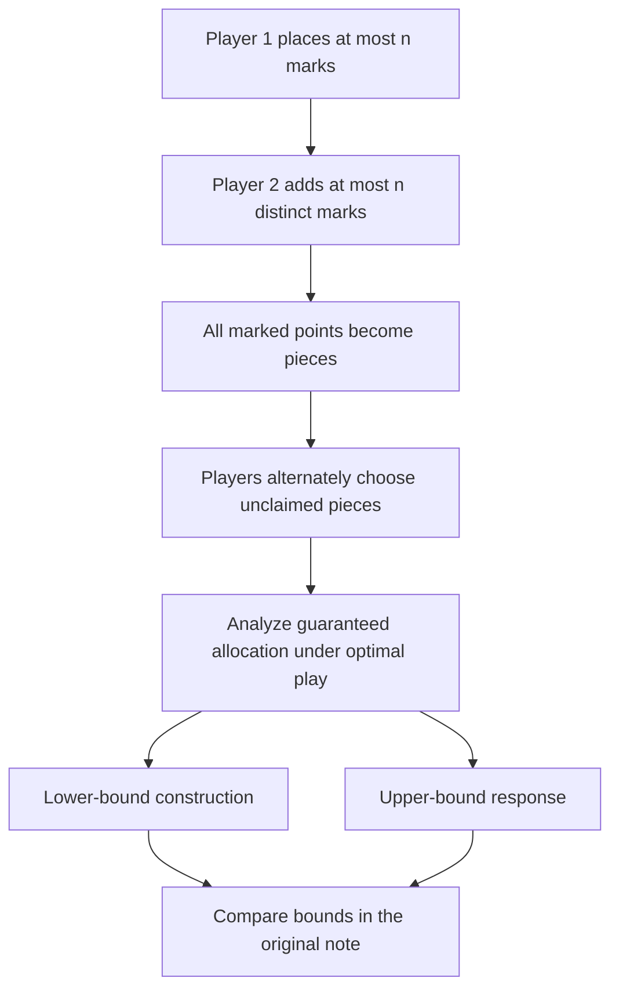

# IMO 2026 Problem 3 | Visual reading guide

This public repository contains a technical companion note on the stick-cutting game and an existing project-authored [SVG of example initial cuts](../figures/optimal-initial-cuts.svg). The original [mathematical note](../README.md) is the complete source of the proposed argument; this guide does not independently certify the proof.

## Read the argument as stages

The existing SVG depicts small worked examples; it is an **actual authored mathematical figure**, not an application screenshot. The reasoning and exact result, including any optimality claim, must be verified from the full proof and official problem statement. This PR does not alter either.

## Attribution and public release

The problem is identified in the README as an IMO 2026 problem. A companion solution must credit the International Mathematical Olympiad and distinguish the source problem from the author's exposition. Do not imply an official IMO solution or endorsement unless documented. No additional licence is assigned to the IMO statement or the figure.

## Suggested GitHub About fields (not applied)

- **Description:** `Technical companion note and original figure for the IMO 2026 Problem 3 stick-cutting game.`
- **Topics:** `mathematics`, `olympiad`, `combinatorics`, `game-theory`, `proof`
- **Homepage:** official problem index is a citation, not a project homepage; leave blank unless a dedicated public note URL exists.

No screenshot is applicable: this is a mathematical note, not a software interface.